<h1 align = "center">T-Echo-Lite-MicroPython</h1>

    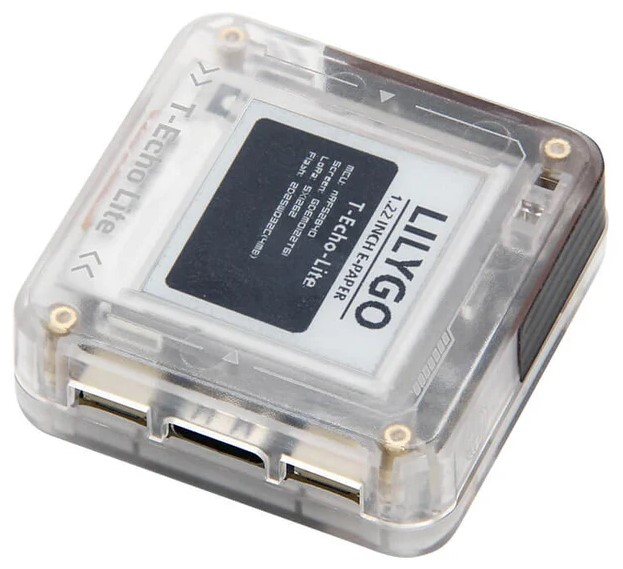

## **[English](./README.md) | 中文**

## 版本迭代:
| Version                               | Update date                       |
| :-------------------------------: | :-------------------------------: |
| T-Echo-Lite_V1.0            | 2024-12-06                         |
| T-Echo-Lite-Kit_V1.0            | 2025-10-14                         |

## 购买链接
| Product                     | SOC           |  FLASH  |  RAM   | Link                   |
| :------------------------: | :-----------: |:-------: | :---------: | :------------------: |
| T-Echo-Lite_V1.0   | nRF52840 |   1M   |256kB| [LILYGO Mall](https://lilygo.cc/products/t-echo-lite?_pos=1&_sid=79b4c08e7&_ss=r&variant=45331277906101) |
| T-Echo-Lite-Kit_V1.0   |  |  || NULL |

## 目录
- [描述](#描述)
- [预览](#预览)
- [模块](#模块)
- [软件部署](#软件部署)
- [引脚总览](#引脚总览)
- [相关测试](#相关测试)
- [常见问题](#常见问题)
- [项目](#项目)

## 描述

T-Echo-Lite是基于T-Echo的轻便版本，拥有比T-Echo更小的体积，更小的功耗设计，最低深度睡眠功耗可达2μA-10μA（不同板子由于板载元器件差异功耗的表现可能不同，这里最低功耗采用LILYGO实验室测定的工程板），板载丰富的功能，惯性传感器、LORA模块、太阳能充电功能（5V）、外置GPS等功能，及其优秀的功耗表现使得T-Echo-Lite能够拥有更为出色的续航。

T-Echo-Lite-Kit为T-Echo-Lite的底板扩展，主要扩展了键盘、扬声器、麦克风、振动等外设。

> [!NOTE]
> T-Echo-Lite-Kit 与 T-Echo-Lite-KeyShield 是同一产品。旧名称仅保留在已有的文件名和目录名中。

> [!IMPORTANT]
> 重要说明：L76K模块和ICM20948模块属于外扩模块默认购买链接不提供这两个模块（其中ICM20948模块为焊接的方式连接，L76K模块为排针的方式连接），需要单独购买。

## 预览

### 实物图

    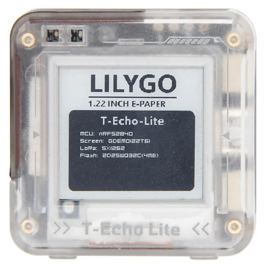

---

    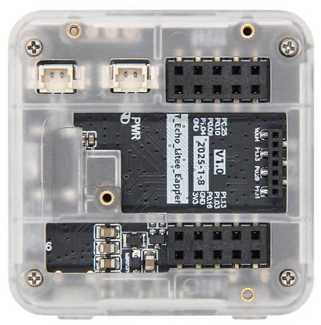

---

    

## 模块

### T-Echo-Lite 部分
### 1. MCU

* 芯片：nRF52840
* RAM：256kB
* FLASH：1M
* 相关资料：
    >[nRF52840_Datasheet](https://docs.nordicsemi.com/bundle/ps_nrf52840/page/keyfeatures_html5.html)

### 2. 屏幕

* 名称：GDEM0122T61

* 尺寸：1.22 英寸

* 分辨率：176x192px

* 屏幕类型：E-PAPER

* 驱动芯片：SSD1681

* 总线通信协议：IIC

* 其他说明：不支持快刷（咨询屏厂后他们回复不支持），建议只使用全刷

* 相关资料：
    >[GDEM0122T61](./information/GDEM0122T61.pdf)  
    >[SSD1681](./information/SSD1681.pdf)

### 3. LORA

* 芯片模组：S62F

* 芯片：SX1262

* 总线通信协议：SPI

* 相关资料：
    >[S62F](./information/S62F.pdf)
    >[S62F 应用说明](./information/S62F_ApplicationNote_Ver_D.pdf)

#### S62F 硬件配置

* 射频开关：T-Echo-Lite 使用 AcSiP 控制模式 A，由 nRF52840 直接控制 `RF_VC1`（`P0.27`）和 `RF_VC2`（`P1.01`）。`DIO2`（`P0.05`）是单独引出的信号，未在本板上硬连接到射频开关。发射时设置 `RF_VC1/RF_VC2` 为 `HIGH/LOW`，接收时设置为 `LOW/HIGH`。
* TCXO：内置 32 MHz TCXO 由 SX1262 的 `DIO3` 内部控制。初始化射频模块时，应将 `tcxoVoltage` 明确设置为 `3.0 V`。
* 稳压器：`VREG` 与 `DCC_SW` 通过 15 uH 电感连接，应使用 DC-DC 稳压模式（`useRegulatorLDO = false`）。

### 4. GPS

* 芯片模组：L76K

* 总线通信协议：UART

* 相关资料：
    >[L76KB-A58](./information/L76KB-A58.pdf)

> [!IMPORTANT]
> 重要说明：L76K模块属于外扩模块默认购买链接不提供这这个模块，需要单独购买。

### 5. 惯性传感器

* 芯片：ICM20948

* 总线通信协议：IIC

* 相关资料：
    >[ICM20948](./information/ICM20948.pdf)
    
> [!IMPORTANT]
> 重要说明：ICM20948模块属于外扩模块默认购买链接不提供这这个模块，需要单独购买。

### 6. Flash

* 芯片：ZD25WQ32C 或者 ZD25Q32D

* 总线通信协议：SPI

* 相关资料：
    >[ZD25WQ32CEIGR](./information/ZD25WQ32CEIGR.pdf)
    >[ZD25Q32DTIGT](./information/ZD25Q32DTIGT.pdf)

### T-Echo-Lite-Kit 部分
### 1. 键盘背光

* 驱动芯片：AW21009QNR

* 总线通信协议：IIC

* 相关资料：
    >[AW21009QNR](./information/AW21009QNR.pdf)

### 2. 振动

* 驱动芯片：AW86224

* 总线通信协议：IIC

* 相关资料：
    >[AW86224AFCR](./information/AW86224AFCR.pdf)

### 3. 扬声器麦克风

* 驱动芯片：ES8311

* 总线通信协议：IIC、IIS

* 相关资料：
    >[ES8311](./information/ES8311.pdf)

### 4. 键盘

* 驱动芯片：TCA8418

* 总线通信协议：IIC

* 相关资料：
    >[tca8418](./information/tca8418.pdf)

## 软件部署

### 示例支持

### T-Echo-Lite示例
| Example | Support | Description | Picture |
| ------  | ------  | ------ | ------ |
| [Battery_Measurement](./examples/T-Echo-Lite/Battery_Measurement) | 
![alt text][supported]  |  |  |
| [BLE_Uart](./examples/T-Echo-Lite/BLE_Uart) | 
![alt text][supported]  |  |  |
| [Button_Triggered](./examples/T-Echo-Lite/Button_Triggered) | 
![alt text][supported]  |  |  |
| [Display](./examples/T-Echo-Lite/Display) | 
![alt text][supported]  |  |  |
| [Display_BLE_Uart](./examples/T-Echo-Lite/Display_BLE_Uart) | 
![alt text][supported]  |  |  |
| [Display_SX1262](./examples/T-Echo-Lite/Display_SX1262) | 
![alt text][supported]  |             |  |
| [Flash](./examples/T-Echo-Lite/Flash) | 
![alt text][supported]  |  |  |
| [Flash_Erase](./examples/T-Echo-Lite/Flash_Erase) | 
![alt text][supported]  |  |  |
| [Flash_Speed_Test](./examples/T-Echo-Lite/Flash_Speed_Test) | 
![alt text][supported]  |  |  |
| [GPS](./examples/T-Echo-Lite/GPS) | 
![alt text][supported]  |  |  |
| [GPS_Full](./examples/T-Echo-Lite/GPS_Full) | 
![alt text][supported]  |  |  |
| [ICM20948](./examples/T-Echo-Lite/ICM20948) | 
![alt text][supported]  |  |  |
| [IIC_Scan_2](./examples/T-Echo-Lite/IIC_Scan_2) | 
![alt text][supported]  |  |  |
| [nrf52840_module](./examples/T-Echo-Lite/nrf52840_module) | 
![alt text][supported]  |  |  |
| [Original_Test](./examples/T-Echo-Lite/Original_Test) |
![alt text][supported]  |  |  |
| [Sleep_Wake_Up](./examples/T-Echo-Lite/Sleep_Wake_Up) | 
![alt text][supported]  |  |  |
| [SX126x_PingPong](./examples/T-Echo-Lite/SX126x_PingPong) | 
![alt text][supported]  |  |  |
| [SX126x_PingPong_2](./examples/T-Echo-Lite/SX126x_PingPong_2) | 
![alt text][supported]  |  |  |
| [sx126x_tx_continuous_wave](./examples/T-Echo-Lite/sx126x_tx_continuous_wave) | 
![alt text][supported]  |             |  |

### T-Echo-Lite-Kit示例
| Example | Support | Description | Picture |
| ------  | ------  | ------ | ------ |
| [aw21009qnr](./examples/T-Echo-Lite-KeyShield/aw21009qnr) | 
![alt text][supported]  |  |  |
| [aw86224](./examples/T-Echo-Lite-KeyShield/aw86224) | 
![alt text][supported]  |  |  |
| [es8311](./examples/T-Echo-Lite-KeyShield/es8311) | 
![alt text][supported]  |             |  |
| [general_test](./examples/T-Echo-Lite-KeyShield/general_test) | 
![alt text][supported]  | 测试程序 |  |
| [tca8418](./examples/T-Echo-Lite-KeyShield/tca8418) | 
![alt text][supported]  |             |  |
| [speaker_certification](./examples/T-Echo-Lite-KeyShield/speaker_certification) | 
![alt text][supported] |  |  |

[supported]: https://img.shields.io/badge/-supported-green "example"

| Bootloader | Description | Picture |
| ------  | ------  | ------ |
| [bootloader](./bootloader/) | |  |

| Firmware | Description | Picture |
| ------  | ------  | ------ |
| [T-Echo-Lite-MicroPython-1.0.0-20260831](./firmware/) |  |  |

### IDE和烧录

#### 1.Thonny IDE

1. 安装 [Thonny IDE]([Thonny, Python IDE for beginners](https://thonny.org/)) 

2. 下载版本 4.1.7 或最新版本（选择 Linux、macOS 或 Windows）

   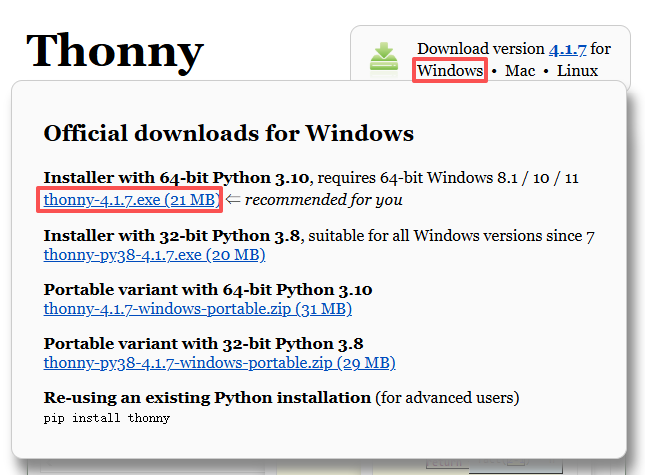

3. 安装完安装包后，打开 Thonny IDE

4. 点击配置解释器

   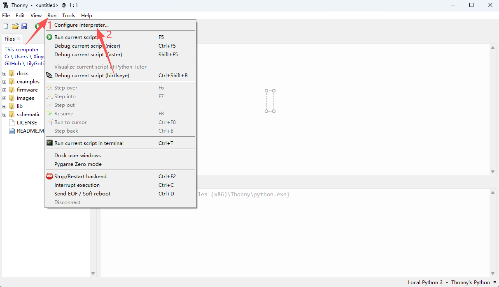

5. 选择MicroPython (通用)

   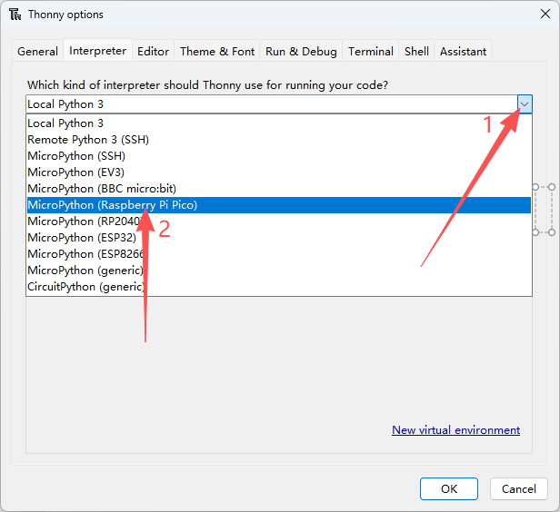

6. 选择相应的端口号并确认

   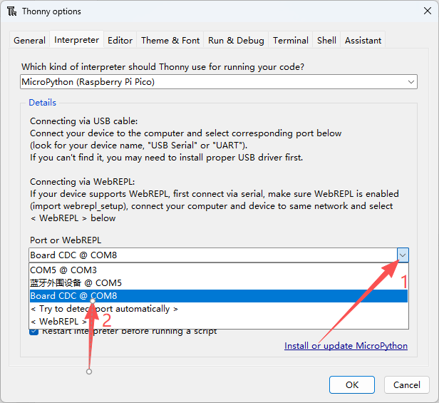

7. 运行程序（在下方打印“hello world”即可。可使用快捷键 F5 运行程序，Ctrl+F2 结束程序）

   `print("hello world")`

   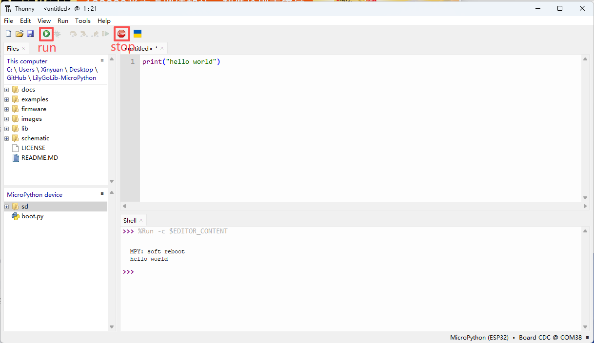

8. 如果要自动运行程序，请点击“保存”，然后选择 MicroPython 设备，并将其命名为 main.py

   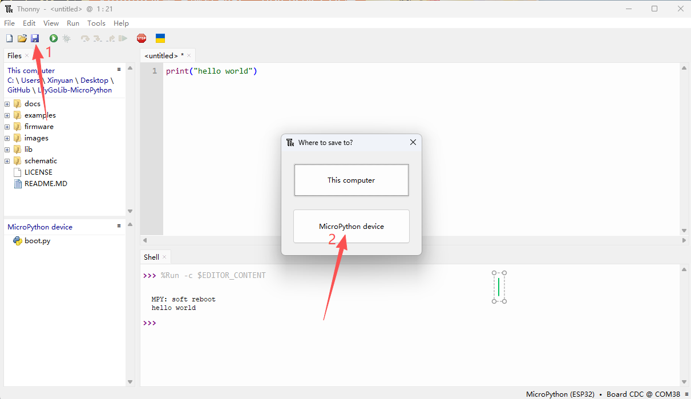

   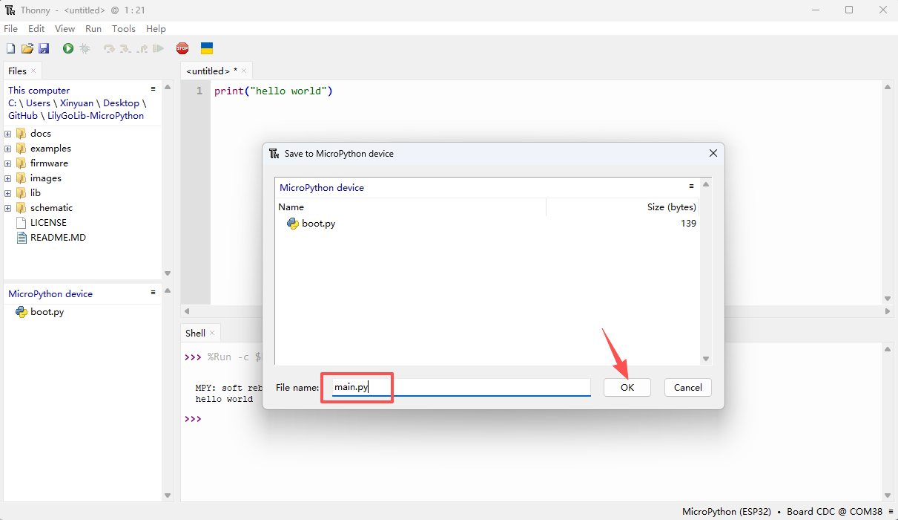

9. 成功保存后，请重启T-Echo-Lite设备

#### 2.Arduino lab for micropython IDE

1. 安装 [Arduino lab for micropython IDE](https://labs.arduino.cc/en/labs/micropython)

2. 安装 **桌面版（选择 Linux、macOS 或 Windows）**

3. 打开文件夹，然后运行“Arduino Lab for MicroPython.exe”

   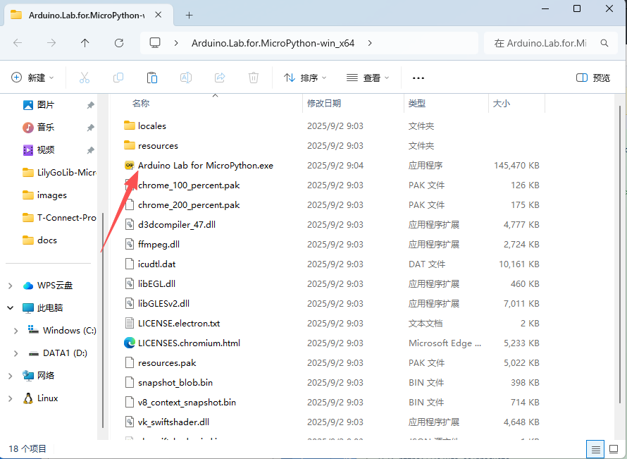

4. 连接对应端口号

   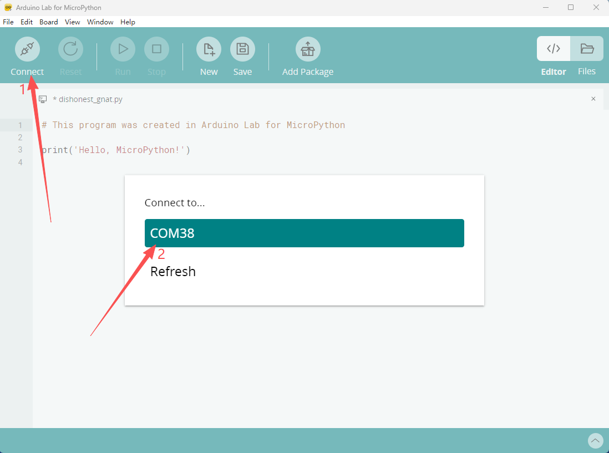

5. 点击运行程序（如需停止程序，请点击停止）。

   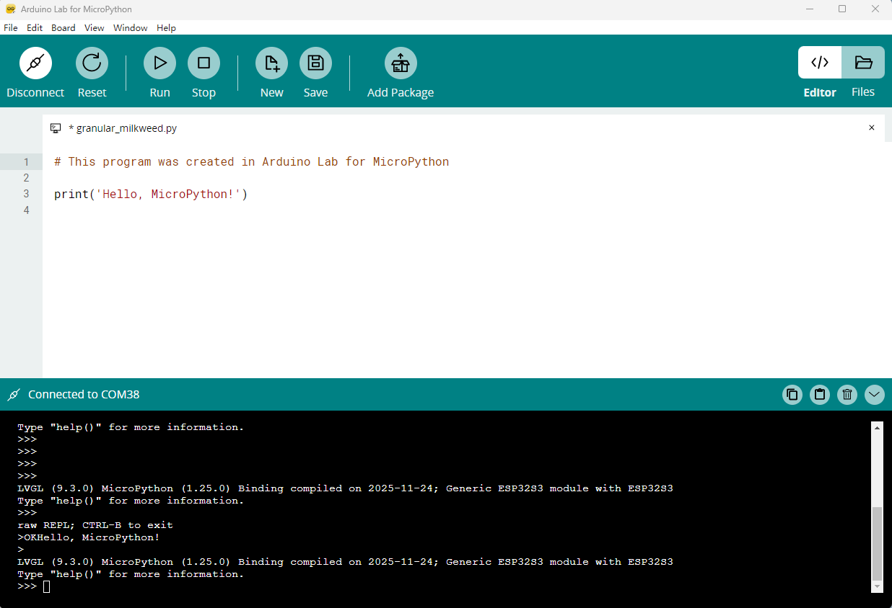

6. 如果要自动运行程序，请点击“文件”，然后创建一个名为“main.py”的新代码。选择“Board”，将代码写入 main.py 文件并保存。然后重置 T-Echo-Lite。

   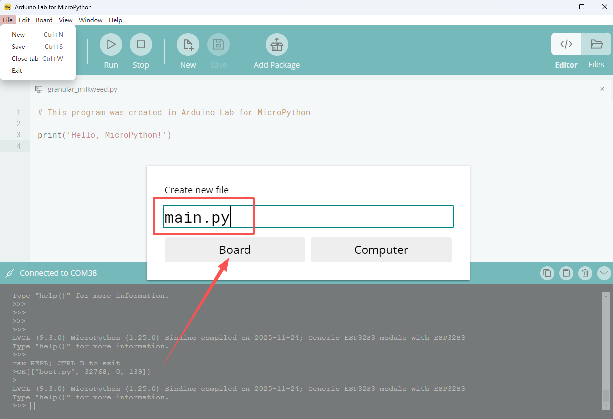

#### 3.RT-Thread MicroPython

1. 安装 [Python](https://www.python.org/downloads/) (根据你操作系统下载相应的版本即可，建议下载3.7或以后的版本即可），MicroPython要求3.x的版本，如果已经安装，可以跳过此步骤）
2. 安装 [Visual Studio Code](https://code.visualstudio.com/Download), 根据你的系统类型选择安装
3. 打开 Visual Studio Code 软件侧边栏的“扩展”（或者使用 "<kbd>Ctrl</kbd>+<kbd>Shift</kbd>+<kbd>X</kbd>" 打开扩展），搜索“RT-Thread MicroPython”扩展并下载
4. 在安装扩展的期间，你可以前往GitHub下载程序，你可以通过点击带绿色字样的“<> Code”下载主分支程序，也通过侧边栏下载“Releases”版本程序
5. 扩展安装完成后，打开侧边栏的资源管理器（或者使用<kbd>Ctrl</kbd>+<kbd>Shift</kbd>+<kbd>E</kbd>打开），点击“打开文件夹”，找到刚刚你下载的项目代码（整个文件夹），点击“添加”，此时项目文件就添加到你的工作区了
6. 点击左下角的 "<kbd>[设备连接/断开](./image/vscode1.png)</kbd>" 然后点击上方弹出的窗口 "<kbd>[COMX](./image/vscode2.png)</kbd>" 进行串口连接，右下角弹出 "<kbd>[连接成功](./image/vscode3.png)</kbd>" 及连接完成
7. 打开代码后，点击左下角的 “<kbd>[▶](./image/vscode4.png)</kbd>”运行程序（或者在代码处点击鼠标右键选择 “<kbd>[直接在设备上运行该MicroPython文件](./image/vscode5.png)</kbd>”，或者使用 <kbd>Alt</kbd>+<kbd>Q</kbd>），如果要停止程序则点击左下角的 “<kbd>[⏹](./image/vscode6.png.png)</kbd>” 停止运行程序。**（如果需要在板子上自动运行程序，请将代码复制到"exampels"文件夹下的"[main.py](examples/main.py)"文件中保存，鼠标左键选中"main.py"文件，点击鼠标右键选择 "[下载该文件/文件夹到设备上](./image/vscode7.png)", 然后按下板子上的复位键即可自动运行程序。）**

#### JLINK烧录firmware和bootloader
1. 安装软件 [nRF-Connect-for-Desktop](https://www.nordicsemi.com/Products/Development-tools/nRF-Connect-for-Desktop/Download#infotabs)

2. 安装软件 [JLINK](https://www.segger.com/downloads/jlink/)

3. 正确连接JLINK引脚如下图

    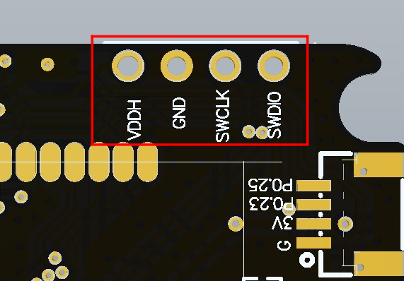

4. 打开软件nRF-Connect-for-Desktop 安装工具 [Programmer](./image/10.png) 并打开

5. 添加文件，同时选择bootloader文件和firmware文件，点击 [Erase&write](./image/11.png) ，即可完成烧录

## 引脚总览

引脚定义请参考配置文件：
 

[t_echo_lite_config.py](./libraries/t_echo_lite_config.py)  

## 常见问题

* Q. 为什么我直接使用USB烧录板子一直烧录失败呢？
* A. 请按一下RST芯片复位按键后松开等待LED1亮后（一定要等待LED1亮）再按一下RST按键后松开，观察到LED1灯逐渐熄灭逐渐点亮，即已进入引导下载模式，这时候就能烧录了。

 

* Q. T-Echo-Lite模块的蓝牙天线和Lora天线应该如何区分呢？
* A. T-Echo-Lite模块的蓝牙天线和Lora天线如下图所示：

    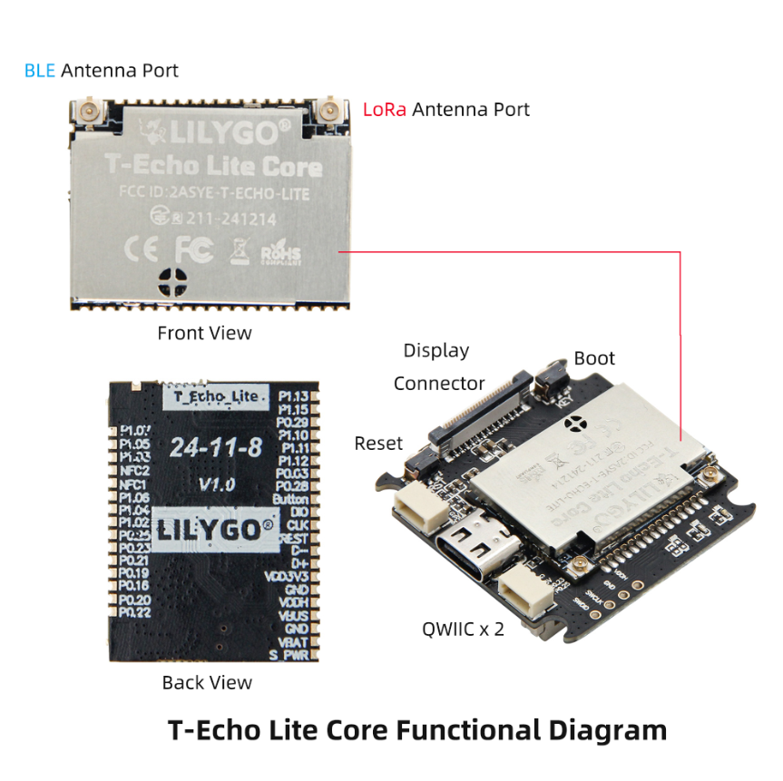

 

## 项目
* [T-Echo-Lite_V1.0](./project/T-Echo-Lite_V1.0)
* [T-Echo-Lite-Kit_V1.0](./project/T-Echo-Lite-KeyShield_V1.0)

